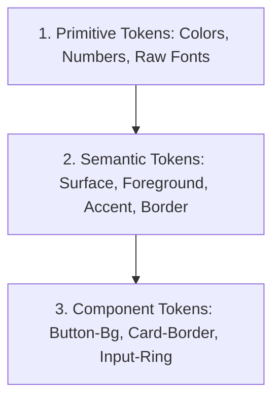

# Full Design System Skill: Awesome DESIGN.md Specification

The **Awesome DESIGN.md** standard establishes a single, comprehensive source of truth for all design tokens, components, and brand rules within a web project.

---

## 1. The 3-Layer Token Architecture

Never use hardcoded values in component styles. Structure design tokens into three strict tiers:



### Layer 1: Primitive Tokens (Raw Values)
```css
:root {
  --color-gold-400: #e5c158;
  --color-gold-500: #d4af35;
  --color-gold-600: #b89326;
  --color-slate-900: #0f172a;
  --color-slate-950: #020617;
  --color-dark-surface: #14120e;
  --color-dark-bg: #090806;
}
```

### Layer 2: Semantic Tokens (Role-Based)
```css
:root {
  --bg-app: #f8f7f6;
  --surface-card: #ffffff;
  --text-primary: #0f172a;
  --text-muted: #64748b;
  --border-subtle: rgba(212, 175, 53, 0.2);
  --accent-brand: var(--color-gold-500);
}

.dark {
  --bg-app: var(--color-dark-bg);
  --surface-card: var(--color-dark-surface);
  --text-primary: #f8fafc;
  --text-muted: #94a3b8;
  --border-subtle: rgba(212, 175, 53, 0.25);
  --accent-brand: var(--color-gold-500);
}
```

### Layer 3: Component Tokens (Component-Specific)
```css
:root {
  --btn-primary-bg: var(--accent-brand);
  --btn-primary-text: #090806;
  --btn-primary-hover: var(--color-gold-400);
  --card-border: var(--border-subtle);
  --card-radius: 16px;
}
```

---

## 2. Token Matrices & Scales

### 2.1 Spacing & Radius Scale
| Token | Pixels | Use Case |
| :--- | :--- | :--- |
| `--space-1` | 4px | Micro-gaps, badge padding |
| `--space-2` | 8px | Button vertical padding, icon gaps |
| `--space-3` | 12px | Compact padding, input vertical |
| `--space-4` | 16px | Standard card padding, gutters |
| `--space-6` | 24px | Section inner spacing |
| `--space-8` | 32px | Card grid gaps |
| `--space-12` | 48px | Section vertical rhythm |
| `--radius-sm` | 6px | Tags, badges |
| `--radius-md` | 10px | Buttons, inputs |
| `--radius-lg` | 16px | Cards, modals |
| `--radius-full` | 9999px | Pills, avatars |

### 2.2 Typography Scale
- **Display Hero**: 48px - 72px / Bold 900 / Tracking -0.03em
- **Section Heading (H2)**: 32px - 40px / Bold 800 / Tracking -0.02em
- **Card Title (H3)**: 20px - 24px / Bold 700 / Tracking -0.01em
- **Body Regular**: 15px - 16px / Regular 400 / Line Height 1.6
- **Caption / Tag**: 12px - 13px / SemiBold 600 / Tracking +0.05em

---

## 3. Project `DESIGN.md` Template

When initializing or maintaining a repository, maintain a `DESIGN.md` in the root:

```markdown
# Design System Specification

## Brand Identity & Aesthetic
- Name: [Project Name]
- Theme: [e.g. Dark Luxury with Gold Accents]
- Font Primary: [e.g. Inter]
- Font Display: [e.g. Outfit / Inter]

## Color Palette (Semantic)
- Background: #090806 (Dark) / #f8f7f6 (Light)
- Primary Accent: #d4af35 (Gold)
- Text Primary: #f8fafc (Dark) / #0f172a (Light)
- Border: rgba(212, 175, 53, 0.25)

## Key Components
- Buttons: Primary (.btn-primary), Secondary (.btn-secondary), Ghost (.btn-ghost)
- Cards: .card-luxury (1px gold border, blurred backdrop)
- Sliders: Touch-enabled before/after comparison
```
